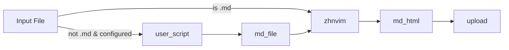

# Zhihu on Neovim

[Zhihu](https://www.zhihu.com/) extension built on [NeoVim](https://github.com/neovim/neovim).

## Features

- [x] Convert local markdown files into Zhihu articles and send them to the draft box;
- [x] Using user-defined scripts to convert other file types into Zhihu articles, then upload them to the draft box.
- [x] Synchronizing Zhihu articles to local markdown files;
- [ ] Support editing Zhihu answers;
- [ ] Support direct publishing of Zhihu articles and answers (bypassing the draft box);
- [ ] Add [blink-cmp](https://github.com/Saghen/blink.cmp) to auto complete @(user name list) and # tags (c.f.: [zhihu_obsidian](https://github.com/dongguaguaguagua/zhihu_obsidian)).
- [ ] Develop and test a more robust conversion library to achieve 100% compatibility with Zhihu-flavored HTML.

## Installation

### rocks.nvim

#### Command style

```vim
:Rocks install zhihu.nvim
```

#### Declare style

`~/.config/nvim/rocks.toml`:

```toml
[plugins]
"zhihu.nvim" = "scm"
```

Then

```vim
:Rocks sync
```

or:

```sh
$ luarocks --lua-version 5.1 --local --tree ~/.local/share/nvim/rocks install zhihu.nvim
# ~/.local/share/nvim/rocks is the default rocks tree path
# you can change it according to your vim.g.rocks_nvim.rocks_path
```

### lazy.nvim

```lua
return {
  "pxwg/zhihu.nvim",
  main = "zhihu",
  ---@type ZhnvimConfigs
  opts = {
    script = {
      typst = {
        pattern = "*.typ",
        extension = { typ = "typst" },
        script = your_script, -- your custom script function
      },
    },
  },
}
```

## Usage

### Zhihu Article

```sh
vi zhihu://XXX.md
# or
vi zhihu://XXX.html
```

or in neovim:

```vim
:edit zhihu://XXX.md
```

The article whose id is XXX will be opened.
After editing,

```vim
:write
```

will save and upload the article.

```vim
:nnoremap <localleader>lv :lua require'zhihu.article'.open()<CR>
```

Press `<localleader>lv` to open the article in your browser.

If you want to create an article from a default template, try:

```vim
:edit zhihu://new.md
```

```markdown
> 本文使用 [Zhihu on NeoVim](https://github.com/pxwg/zhihu.nvim) 创作并发布
```

If you try to open a non-existent article, you will see:

```vim
:edit zhihu://0.md
```

```markdown
# 404

你似乎来到了没有知识存在的荒原

[去往首页](https://www.zhihu.com)
```

You can update zhihu article by:

```lua
local Article = require 'zhihu.article.markdown'.Article
-- or if your prefer using HTML to write article
-- local Article = require 'zhihu.article.html'.Article
local id = "your_article_id"
local article
if id then
  article = Article:from_id(id)
  -- or create an article
else
  article = Article { title = "title" }
end
local f = io.open "/the/path/of/your/article.md"
if f then
  local markdown = f:read "*a"
  f:close()
  article:set_content(markdown)
  article:update()
end
```

### Zhihu Auth

In order to log in zhihu, this library search

- firefox cookies database
- chrome cookies database
- pychrome: a python module to communicate with chrome browser.
  open <https://www.zhihu.com/> to let user to log in

A cookies will be cached. If you meet `403 Forbidden`, try:

1. quit browser: avoid browser lock cookies database
2. restart neovim: fetch latest cookies from browser cookies database

If it doesn't work, try:

1. log in zhihu again: update cookies of browser cookies database
2. quit browser
3. restart neovim

### Conversion Script

`zhihu_on_neovim` offers a conversion API (implemented in Rust, compiled as a Lua dynamic library) to convert local CommonMark files to Zhihu-flavored HTML and upload them as drafts.

By default, only `.md` files are directly supported. If your input is not Markdown, you can define a custom Lua script to convert it to CommonMark first, then use the API for further conversion and upload.



Custom scripts should be Lua functions with this signature:
```lua
---@param input input_content
---@return output md_content
local your_script = function(input)
  -- your logic here
  return output
end
```
Where `input_content` contains:
```lua
---@field content string  -- file content
---@field title string    -- file title
---@field path string     -- file path
```
And `md_content` should return:
```lua
---@field content_md string  -- Markdown content
---@field title_md string    -- Markdown title
```

Example: using `pandoc` to convert a Typst file to Markdown with a user defined Lua filter:
```lua
local function typst_script(content)
  local cmd = {
    "pandoc",
    content.path,
    "-t",
    "markdown",
    "--lua-filter=" .. vim.fn.stdpath("config") .. "/typ_md.lua",
  }
  local result = vim.fn.system(cmd)
  if vim.v.shell_error ~= 0 then
    return { title = content.title, content = "Error: " .. result }
  end
  return { title = content.title, content = result }
end
```

## Similar Projects

- [zhihu_obsidian](https://github.com/dongguaguaguagua/zhihu_obsidian)
- [VSCode-Zhihu](https://github.com/niudai/VSCode-Zhihu)

## Related Projects

- [md2zhihu](https://github.com/drmingdrmer/md2zhihu): convert markdown to zhihu markdown
